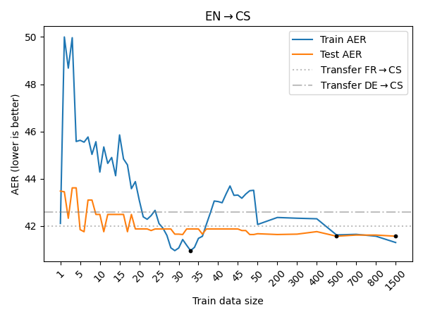
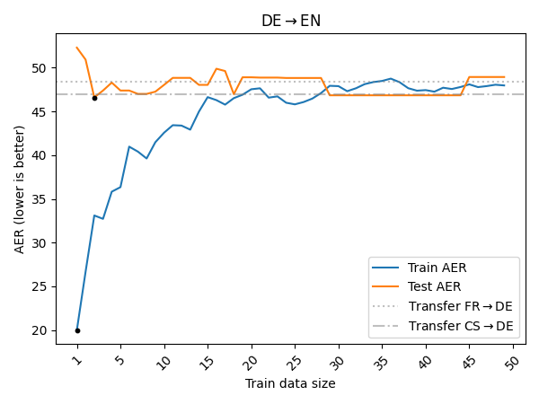
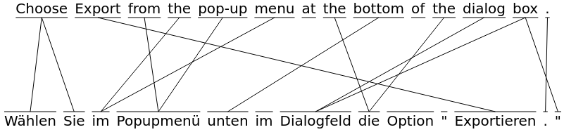

# SlowAlign

Word aligner written in Rust with a few extra features, most notably (1) heuristic parameter estimation in a supervised fashion using gridsearch, (2) combination of multiple soft alignments and (3) data-less alignment based on diagonal alignment, Levenstein distance and blurring. See [Project report of Mar 2021](meta/REPORT.pdf) for (a lengthy) description.




```
USAGE:
    slow_align [FLAGS] [OPTIONS]

FLAGS:
        --gold-index-one    Treat gold alignments as if they are 1-indexed
                            (default is 0-indexed)
    -h, --help              Prints help information
        --lowercase         Treat everything case-insensitive (default is case-sensitive,
                            even though that provides slightly worse performance).
        --switch-dic        Switch the columns for dictionaries, default (src, tgt).
    -V, --version           Prints version information

OPTIONS:
        --dev-count <dev-count>        Number of sentences (from the top) to use for
                                       parameter estimation. [default: 0]
    -d, --dic <dic>                    OPUS-like dictionary of word translation
                                       probabilities
    -f, --file1 <file1>                Path to the source file to align. (If both files
                                       and sentences are provided, only files are used).
    -f, --file2 <file2>                Path to the target file to align. (If both files
                                       and sentences are provided, only files are used).
    -g, --gold <gold>                  Path to the file with alignments (single space
                                       separated, x-y for sure alignments, x?y for
                                       possible). `x` and `y` are (by default) 0-indexed
                                       token indicies.
        --ibm-steps <ibm-steps>        Number of steps to use for IBM1 computation.
                                       [default: 5]
    -m, --method <method>              Which alignment method pipeline to use (static,
                                       dic, levenstein, ibm1, search, a5_fixed)
                                       [default: static]
    -p, --params <params>              Comma-separated arrays of parameters to the
                                       estimator recipe
    -s, --sent1 <sent1>                List of source sentences (separated by \n)
                                       to align.
    -s, --sent2 <sent2>                List of target sentences (separated by \n)
                                       to align.
        --test-offset <test-offset>    Offset from which to evaluate data. If not
                                       supplied, use --dev-count value (so that dev and
                                       test do not overlap).
```

&nbsp;

```
USAGE:
    slow_align_dic [FLAGS] [OPTIONS] <file1> <file2> <out>

ARGS:
    <file1>    Path to the source file to train word translation probabilities on.
    <file2>    Path to the target file to train word translation probabilities on.
    <out>      Path to the output word translation probabilities dictionary.

FLAGS:
    -h, --help         Prints help information
        --lowercase    Treat everything case-insensitive (default is case-sensitive,
                       even though that provides slightly worse performance).
    -V, --version      Prints version information

OPTIONS:
    -t, --threshold <threshold>    Threshold under which translation probabilities
                                   will be omitted. Lower values lead to better
                                   approximation, but also larger file size.
                                   [default: 0.2]
```


# SlowAlignDisplayer

For an easy to use displayer of word alignment, see [SlowAlignDisplayer](https://github.com/zouharvi/SlowAlignDisplayer).


